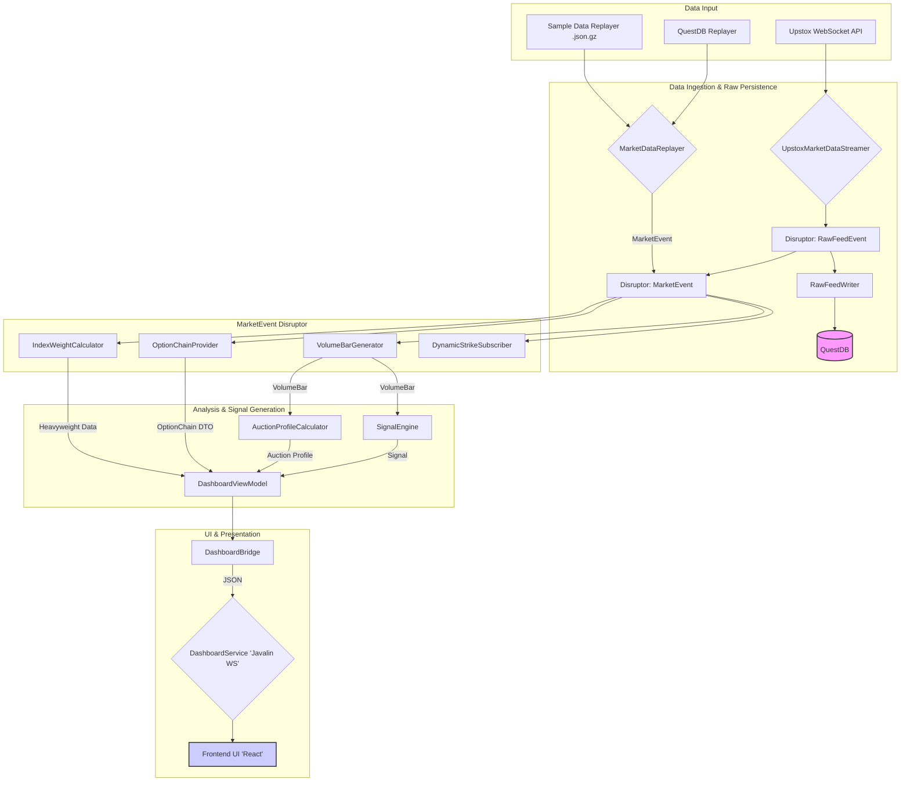

# JULES-HF-ATS: High-Frequency Auction Trading System

JULES-HF-ATS is a sophisticated, event-driven trading application designed for real-time market data analysis and signal generation, with a primary focus on Auction Market Theory. It is built to process high-volume market data feeds with low latency, identify potential trading opportunities based on volume profiles and order book dynamics, and visualize this information through a comprehensive and interactive dashboard.

## Key Technologies

*   **Language:** Java 21 (LTS) with Project Loom for virtual threads.
*   **Core Architecture:** LMAX Disruptor for lock-free, high-throughput messaging.
*   **Data Ingestion:** Upstox API v3 (Protobuf/WebSocket) for live market data.
*   **Persistence:** QuestDB via the Influx Line Protocol (ILP) for high-speed tick data storage.
*   **Dashboard:** Javalin web server with WebSockets and a React-based frontend.

## High-Level Architecture & Data Flow

The application's architecture is designed to decouple data ingestion, processing, and presentation. This is achieved through an event-driven pipeline powered by the LMAX Disruptor.

### Data Flow Diagram



## How to Run

### Prerequisites

1.  **Java 21+** and **Maven**.
2.  **Node.js** and **npm**.
3.  **Create a Configuration File:**
    ```bash
    cp ats-core/src/main/resources/config.properties.example ats-core/src/main/resources/config.properties
    ```
4.  **WebSocket Port:** The backend WebSocket server runs on port `7070`.

### Configuration

Edit `ats-core/src/main/resources/config.properties` to set your configuration.

```properties
# Application Run Mode: "live" or "simulation"
run.mode=simulation

# Upstox API Access Token (only required for "live" mode)
upstox.accessToken=YOUR_ACCESS_TOKEN_HERE

# QuestDB Integration
questdb.enabled=false

# Dashboard UI
dashboard.enabled=true

# Simulation event delay in milliseconds
simulation.event.delay.ms=10

# Replay source: "sample_data" (for now)
replay.source=sample_data
```

### Running the Application

#### 1. Simulation / Backtest Mode

1.  **Configure for Simulation:**
    ```properties
    run.mode=simulation
    ```
2.  **Ensure Sample Data Exists:**
    ```bash
    python3 scripts/generate_data.py
    ```
3.  **Run the Backend:**
    ```bash
    mvn clean install
    java -jar ats-dashboard/target/ats-dashboard-1.0-SNAPSHOT-jar-with-dependencies.jar
    ```
4.  **Run the Frontend:**
    ```bash
    cd ats-dashboard/frontend
    npm run dev
    ```
    Open your browser to `http://localhost:5173`.

#### 2. Live Mode

1.  **Configure for Live Mode:**
    ```properties
    run.mode=live
    upstox.accessToken=YOUR_ACCESS_TOKEN_HERE
    ```
2.  **Run the Backend and Frontend** as in Simulation mode.

## System Design

### Core Concepts

*   **Auction Market Theory:** The system is built on the principles of Auction Market Theory, which analyzes the market as a continuous two-way auction.
*   **Volume Profile:** A histogram of volume traded at each price level, used to identify key areas of support and resistance.
*   **LMAX Disruptor:** A high-performance inter-thread messaging library that forms the backbone of the event-driven architecture.

### UI/UX Design

The frontend is a 6-widget design that provides a comprehensive overview of the market and the system's analysis.

*   **The "Vitals" Bar:** High-level summary of system health and market baseline.
*   **The Auction Profile:** A volume profile chart showing VAH, VAL, and POC.
*   **The Weighted Heavyweights:** Lists the top 5-7 Nifty stocks with their weighted delta.
*   **Dynamic Option Chain:** A sliding window of ATM ± 2 strikes.
*   **Sentiment & Trigger Alerts:** Translates the "Brain" into human-readable alerts.
*   **Trade Panel & Theta-Guard:** A countdown timer and live P&L for open trades.

## Project Backlog

This section outlines the remaining features, enhancements, and bug fixes required to complete the HF-ATS.

### Phase 1: Core Trading Logic Implementation (The "Brain")
- [ ] Implement Auction Profile Calculator
- [ ] Implement Signal Engine
- [ ] Implement Option Chain "Change in OI" Monitor
- [ ] Implement Theta-Exit Guard

### Phase 2: Order Execution and Management
- [ ] Implement Order Execution
- [ ] Implement Order Modification and Cancellation

### Phase 3: Frontend UI/UX Development [COMPLETED]

### Phase 4: Monitoring and Health Dashboard [COMPLETED]

### Phase 5: Backtesting and Performance
- [ ] Resolve Backtesting Environment Issue
- [ ] Performance Tuning
